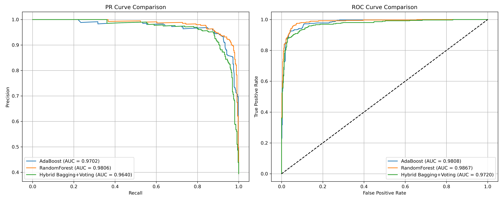
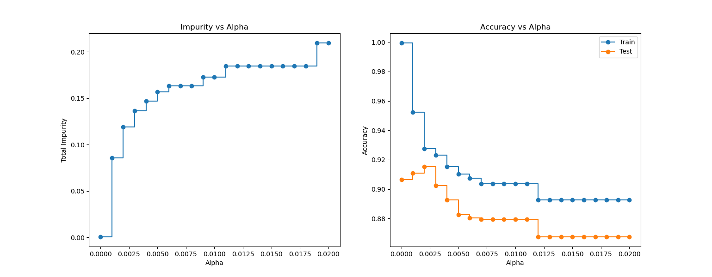
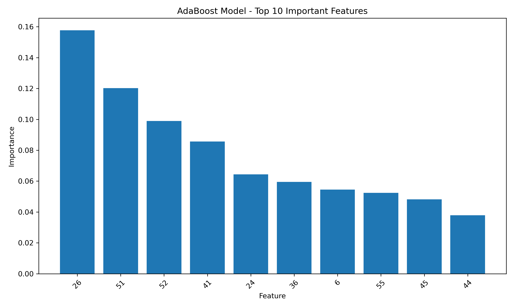

# 垃圾邮件分类系统（集成学习算法对比与探索）

基于多种机器学习算法的垃圾邮件分类项目，对比不同集成学习方法的性能表现。

## 项目简介

本项目实现了基于 **Spambase 数据集** 的垃圾邮件分类系统，通过对比多种机器学习算法和集成学习方法，评估不同模型在垃圾邮件检测任务中的性能表现。

### 主要内容

- **基础分类器**：决策树、朴素贝叶斯、神经网络
- **集成学习方法**：
  - Voting（投票集成）
  - Bagging（Bootstrap Aggregating）
  - Stacking（堆叠集成）
  - Random Forest（随机森林）
  - AdaBoost（自适应提升）
- **自定义分类器**：基于特征的简单判断规则
- **混合集成**：Bagging + Voting 组合策略
- **模型评估**：准确率、精确率、召回率、F1分数、PR曲线、ROC曲线

## 数据集说明

### Spambase 数据集

- **来源**：惠普实验室，1999年6-7月收集
- **样本数量**：4,601封邮件
- **特征数量**：57个特征
- **类别**：垃圾邮件(1) / 正常邮件(0)

### 特征说明

- **48个词频特征**：邮件中特定词汇出现的频率
- **6个字符频率特征**：特定字符组合的出现频率
- **3个统计特征**：大写字母的平均长度、最大长度、总长度

### 特殊特征

根据数据集文档，以下特征是**非垃圾邮件的标志**：

- **第27列**：包含"george"的邮件
- **第28列**：包含"650"区号的邮件

## 算法原理

### 1. 决策树

- 使用CART算法实现
- 通过Cost Complexity Pruning进行剪枝
- 最优α值：0.0025

### 2. 集成学习

#### Voting（投票集成）

- **硬投票**：多数表决
- **软投票**：概率加权平均

#### Bagging（Bootstrap Aggregating）

- 有放回采样训练多个基分类器
- 支持OOB（Out-of-Bag）评估

#### Stacking（堆叠集成）

- 多个基分类器作为第一层
- 逻辑回归作为元分类器
- 5折交叉验证

#### Random Forest（随机森林）

- 500棵决策树
- 最大深度：10
- 特征选择：√N

#### AdaBoost（自适应提升）

- 基分类器：决策树桩
- 50个弱分类器
- SAMME算法

## 项目结构

```
MachineLearning/
├── README.md                    # 项目说明
├── requirements.txt             # 依赖包
├── .gitignore                   # 忽略文件
├── data/                        # 数据文件夹
│   └── spambase/         
│       ├── spambase.data       # 数据集
│       ├── spambase.names      # 特征说明
│       └── spambase.DOCUMENTATION # 数据集文档
├── src/                         # 源代码
│   └── report3.py              # 主程序
└── results/                     # 结果文件夹
    ├── ada_evaluation_curves.png  # AdaBoost评估曲线
    ├── ada_feature_importance.png  # 特征重要性
    └── ccp_alpha.png           # 剪枝参数分析
```

## 环境依赖

```bash
numpy>=1.21.0
pandas>=1.3.0
matplotlib>=3.4.0
scikit-learn>=0.24.0
```

安装命令：

```bash
pip install -r requirements.txt
```

## 运行方式

1. 确保数据文件在 `data/spambase/` 目录下
2. 运行主程序：

```bash
python src/report3.py
```

## 实验结果

### 关键模型性能对比

| 模型                  | 准确率 | 精确率 | 召回率  | F1分数  | PR-AUC | ROC-AUC |
| --------------------- | ------ | ------ | ------- | ------- | ------ | ------- |
| AdaBoost              | 0.9424 | 0.9356 | 0.92016 | 0.92786 | 0.9702 | 0.9808  |
| RandomForest          | 0.9511 | 0.9474 | 0.8926  | 0.9191  | 0.9806 | 0.9867  |
| Hybrid Bagging+Voting | 0.9033 | 0.8246 | 0.9587  | 0.8866  | 0.9640 | 0.9720  |

注：未设置随机种子，每次结果可能并不一致。

### 主要发现

1. **决策树剪枝**：通过Cost Complexity Pruning优化模型复杂度
2. **集成学习优势**：Bagging和Stacking显著提升模型性能
3. **特征重要性**：AdaBoost可识别关键特征
4. **混合策略**：Bagging + Voting组合策略表现优异

### 性能对比

- 多模型性能对比表格
- 准确率、精确率、召回率、F1分数综合评估
  

## 创新点

1. **自定义分类器**：基于领域知识的简单判断规则
2. **混合集成策略**：Bagging + Voting组合方法
3. **多维度评估**：全面的性能指标和可视化分析
4. **剪枝优化**：Cost Complexity Pruning参数调优

## 技术细节

### 数据预处理

- 分层抽样（stratified sampling）划分训练集和测试集
- 测试集比例：20%

### 模型调优



- 决策树：最优α=0.0025
- 神经网络：早停机制，防止过拟合
- 随机森林：500棵树，最大深度10
  
- AdaBoost：特征重要性

### 评估指标

- **准确率**：整体分类正确率
- **精确率**：预测为垃圾邮件中真正垃圾邮件的比例
- **召回率**：真正垃圾邮件中被正确识别的比例
- **F1分数**：精确率和召回率的调和平均
- **PR-AUC**：精确率-召回率曲线下面积
- **ROC-AUC**：ROC曲线下面积

## 参考资料

- Spambase数据集文档
- scikit-learn官方文档
- 《Pattern Recognition and Machine Learning》
- 《Elements of Statistical Learning》
